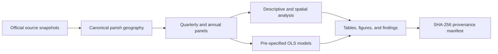

# Lisbon Spatial Dynamics

**Housing values, local accommodation, and neighbourhood change across Lisbon's 24 parishes.**

[](https://github.com/DiogoRibeiro7/lisbon-spatial-dynamics/actions/workflows/ci.yml)
[](https://diogoribeiro7.github.io/lisbon-spatial-dynamics/)
[](pyproject.toml)
[](LICENSE)

Lisbon Spatial Dynamics is a Python research pipeline for examining how changes in housing values relate to local accommodation pressure at the *freguesia* (civil parish) level. It combines official Portuguese data, builds comparable neighbourhood panels, and produces descriptive statistics, spatial diagnostics, regression tables, maps, and a record of the inputs used.

[Documentation](https://diogoribeiro7.github.io/lisbon-spatial-dynamics/) · [Getting started](docs/getting-started.md) · [Methodology](docs/methodology.md) · [Contributing](CONTRIBUTING.md) · [Changelog](CHANGELOG.md)

> **Research scope:** results describe associations across neighbourhoods. They do not establish that local accommodation causes housing-price changes. The analysis uses a small sample of 24 parishes and a fixed Census 2021 population denominator.

## What you can do

- Acquire timestamped snapshots from INE, Turismo de Portugal, and DGT.
- Match housing and accommodation records to a validated, common parish geography.
- Reconstruct quarterly accommodation registrations, cessations, stock, and capacity; compare annual Q4 observations.
- Measure accommodation pressure per 1,000 Census 2021 residents and housing-value change over a common time window.
- Assess Pearson/Spearman associations, Global Moran's I, and Local Moran/LISA clusters with false-discovery-rate control.
- Fit four pre-specified OLS models with HC3 robust uncertainty, influence diagnostics, and leave-one-parish-out sensitivity.
- Generate CSV tables, PNG figures, JSON/Markdown findings, and SHA-256 input/output provenance.

## Project status

[Version 1.0.1](https://github.com/DiogoRibeiro7/lisbon-spatial-dynamics/releases/tag/v1.0.1) adds committed empirical datasets and generated findings as a patch correction to the v1.0.0 software release. The full raw-snapshot pipeline remains available for reproducible study runs; fetching today's sources creates a new run rather than reproducing an earlier archived snapshot.

The test suite exercises local fixtures without downloading the research datasets. Live source availability and a study run using official data require separate verification. Mobility, accessibility, infrastructure, and additional longitudinal demographic sources are outside the v1 scope.

The [2026-10-01 primary-source audit](docs/source-audit.md) verifies housing coverage for all 24 parishes over 2019 Q4–2026 Q1 and reads the official Census workbook. The RNAL snapshot has no populated cessation dates and includes unusually early registration dates. Historical RNAL completeness remains unresolved; this input set is not yet designated the definitive v1.1 study.

The [RNAL coverage investigation](docs/rnal-coverage.md) confirms the early dates in a second official feed, finds 172 conflicting parish assignments, and reconstructs only 11,525 registrations at November 2022 against the municipality's published 20,134. Historical extracts and geographic reconciliation are needed before the definitive run.

The [geographic follow-up](docs/rnal-geography.md) finds that all 172 disputed map coordinates fall in the GIS-labelled CAOP2025 parish; 67 are within 25 metres of a boundary. The results support GIS label consistency, with positional uncertainty retained and no automatic corrections.

The [parish-label sensitivity analysis](docs/rnal-parish-sensitivity.md) holds the retained SOAP cohort and captured capacity fixed. Both GIS scenarios change six parishes' record-pressure ranks by one position and preserve the top four; local count and capacity differences can change direction. These scenarios do not resolve historical completeness or correct registry records.

### Committed empirical evidence

The [historical municipal benchmarks](docs/cml-historical-benchmarks.md) add November 2019/2022 observations for all 24 parishes. The capacity table reconciles at 111,492 and 116,218 places; weighted-AL values are kept separate from raw registration counts, with displayed arithmetic differences recorded explicitly. These two observations do not constitute the quarterly series required for v1.1.

The [community RNAL archive assessment](docs/rnal-archive-coverage.md) adds 13 captures from May 2025 to October 2026. It identifies 339 repeated Lisbon rows and 418 reappearance observations, demonstrating why absence from an export cannot be treated as a dated closure. These qualified historical observations remain outside the definitive study inputs.

The repository includes a small inspectable release layer:

```text
data/release/v1.0.1/
results/release/v1.0.1/
```

The data directory contains five 24-freguesia tables with provenance notes. The results directory contains summary metrics, association results, and machine/human-readable findings. Large raw source snapshots remain outside Git.

## Quick start

You need **Python 3.12 or newer**, **Poetry 2.2.1**, and Git. The CI matrix covers Python 3.12 and 3.13 on Linux and Python 3.13 on Windows. Install Poetry using its [installation guide](https://python-poetry.org/docs/#installation).

```bash
git clone https://github.com/DiogoRibeiro7/lisbon-spatial-dynamics.git
cd lisbon-spatial-dynamics
poetry sync --with docs
poetry run build-study-v1 --help
poetry run pytest -q
```

These checks need no research data or service credentials. Installation downloads dependencies; subsequent tests use local fixtures. Run commands from the repository root so the versioned configuration files can be found.

To preview the documentation:

```bash
poetry run mkdocs serve
```

## Data and study design

| Source | What it contributes | Interpretation |
| --- | --- | --- |
| INE, indicator `0012234` | Median dwelling sale value per m², published quarterly under NUTS 2024 | The value covers sales in the preceding 12 months; it is not a quarterly transaction-level price index. |
| Turismo de Portugal, RNAL | Registration/cessation dates and accommodation capacity | Historical stock is reconstructed from the records present in a registry snapshot. |
| INE, Censos 2021 | Population, tenure, age, vacancy, and building characteristics | A static reference, not annual demographic observations. |
| DGT, CAOP2025 | Boundaries and identifiers for Lisbon's 24 parishes | A common reference geography, with explicit identifier and name checks. |

Source endpoints and acquisition settings live in [`configs/`](configs/). The [data-source guide](docs/data-sources.md) describes schemas, missing values, privacy filtering, and the separate historical NUTS 2013 housing series.



The comparison window is derived from the available common observations. No fixed date range or numerical finding is implied by the examples in this README.

## Build a study

First acquire the four source families:

```bash
poetry run fetch-caop-lisbon
poetry run fetch-ine-housing --config configs/ine_housing_study.toml
poetry run fetch-rnal-lisboa
poetry run fetch-census2021-population
```

Each command prints its saved paths. Follow the [complete walkthrough](docs/getting-started.md#prepare-the-reference-geography) to turn the CAOP snapshot into the reference CSV and GeoJSON. Then pass those files and the selected snapshots to the study command:

```bash
poetry run build-study-v1 \
  data/raw/ine/housing/0012234/study_2019q4_2026q1/<timestamp>.data.json \
  data/raw/turismo_portugal/rnal/lisboa/<timestamp>.records.json \
  data/raw/ine/census2021/subsections/<timestamp>.zip \
  data/processed/reference/lisbon_freguesias.csv \
  data/processed/reference/lisbon_freguesias.geojson \
  data/processed/releases/my-study
```

Replace each `<timestamp>` with the actual filename printed by its fetch command. The multiline example uses Bash syntax; in PowerShell, put the command on one line. The output directory must not already exist. Raw downloads and generated data are ignored by Git.

The explicit housing configuration requests 26 quarters and the 24 Lisbon parishes. The unfiltered `fetch-ine-housing` default returns only the latest quarter and cannot supply a longitudinal study on its own. Review the [source audit](docs/source-audit.md) before interpreting reconstructed RNAL stocks as historical observations.

Defaults are 999 spatial permutations, seed 42, Local Moran FDR alpha 0.05, and the model specifications in [`configs/multivariable_models.toml`](configs/multivariable_models.toml). Use `--help` for overrides.

## Outputs

```text
data/processed/releases/my-study/
├── reference/                 # Census population reference
├── panels/                    # Housing, RNAL, and joined panels
├── context/                   # Census context and enriched annual panel
├── analysis/
│   ├── normalized/            # Descriptive and spatial analysis
│   └── multivariable/         # Coefficients, diagnostics, and sensitivity
├── results/final/
│   ├── table_1_descriptive.csv
│   ├── table_2_spatial.csv
│   ├── table_3_models.csv
│   ├── table_4_diagnostics.csv
│   ├── findings.json
│   ├── findings.md
│   ├── figure_1_pressure_association.png
│   ├── figure_2_pressure_coefficients.png
│   └── figure_3_primary_residuals.png
└── study_manifest.json
```

Start with `results/final/findings.md`, then inspect the tables and diagnostics. The [results guide](docs/results.md) explains coefficient units and uncertainty. The [reproducibility guide](docs/reproducibility.md) explains the manifest and what to archive with a study run.

## Repository layout

| Path | Purpose |
| --- | --- |
| [`src/lisbon_spatial_dynamics/`](src/lisbon_spatial_dynamics/) | Acquisition, transformations, panels, analysis, maps, and command-line entry points |
| [`configs/`](configs/) | Source catalogue, endpoints, and pre-specified models |
| [`tests/`](tests/) | Offline unit and integration tests |
| [`docs/`](docs/) | MkDocs documentation and methodological detail |
| `data/raw/`, `data/interim/`, `data/processed/` | Local data workspace; generated contents are not committed |
| [`data/release/v1.0.1/`](data/release/v1.0.1/) | Curated committed empirical evidence with provenance |
| [`results/release/v1.0.1/`](results/release/v1.0.1/) | Committed empirical summary/results for the patch release |
| [`.github/workflows/`](.github/workflows/) | Code checks, tests, package build, and documentation deployment |

## Development

```bash
poetry sync --with docs
poetry run pre-commit install
poetry check --lock --strict
poetry run ruff check .
poetry run ruff format --check .
poetry run mypy src tests
poetry run pytest -q
poetry run mkdocs build --strict
poetry build
```

CI runs these checks on pull requests. See [CONTRIBUTING.md](CONTRIBUTING.md) for the workflow, data-handling conventions, and requirements for methodological changes. Report reproducible problems through the [issue tracker](https://github.com/DiogoRibeiro7/lisbon-spatial-dynamics/issues/new/choose).

## Citation and licence

Use GitHub's **Cite this repository** control or [`CITATION.cff`](CITATION.cff). Cite the exact software version used, retain the study manifest, and credit the original data providers separately.

The software is licensed under the [MIT licence](LICENSE). Third-party datasets retain their providers' terms; the software licence does not grant rights to redistribute them. RNAL acquisition discards proprietor/contact fields before saving the analytical snapshot. See the [data-source guide](docs/data-sources.md) for details.
